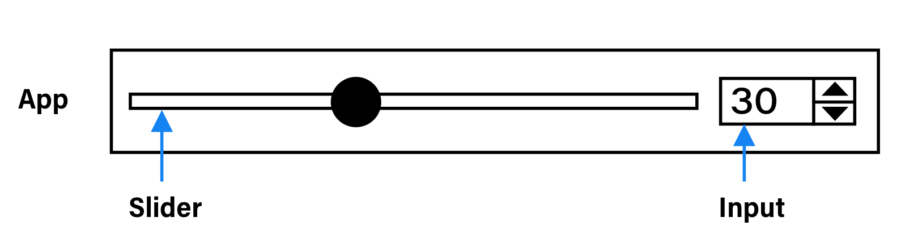

# the-slider-test

The Slider Test: Implementing a basic slider UI element with various libraries.

## The test

Create an app that has a slider and a numeric input. The user can change the value from either the slider (via mouse events), or the input (via input events), and the two should remain in sync.

## Implementations

* [Svelte](./libraries/svelte/)
* [React (with hooks)](./libraries/react/)

## Contributing

The implementations aim to paint the best picture possible for a particular library. New variants for a library, as well as implementations for new libraries, are welcome!
